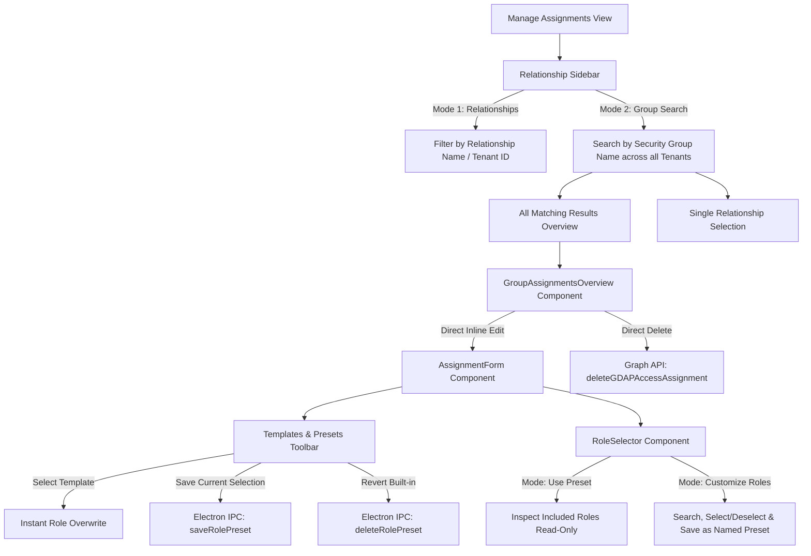

# GDAP Manager - Security Group Search & Dynamic Role Presets Documentation

## 1. Overview

The **GDAP Manager** includes an enhanced workflow in the **"Manage Assignments"** section that enables:
1. **Cross-Relationship Security Group Search:** Search for any security group name (e.g. `Desktop`, `Helpdesk`, `CSCT_M365_Compliance`) across all tenant relationships at once.
2. **Direct In-line Assignment Editing & Deletion:** Modify roles or remove assignments directly from the cross-relationship search view with full Microsoft Graph API synchronization.
3. **Dynamic Role Presets & Template Customization:** Customize, persist, and apply named role presets across any security group and overwrite existing multi-role assignments in a single click.
4. **Preset Role Transparency:** Inspect all included Entra ID roles in read-only mode when a preset is selected before applying changes.

---

## 2. Key Architecture & Features

---

## 3. Detailed Component Breakdown

### 3.1. Cross-Relationship Group Search (`RelationshipList.tsx`)
- **Dual-Mode Tab Switcher:**
  - **Relationships Tab:** Conventional filter by relationship display name or customer tenant ID.
  - **Group Search Tab:** Scans all cached and preloaded access assignments for group names and object IDs matching the search term.
- **Top Summary Card ("All Matching Results"):**
  - Displays the total count of matched group assignments across all tenant relationships.
  - Clicking this switches the main viewport to the comprehensive search overview.
- **Quick Suggestions:**
  - Suggests popular detected family prefixes (e.g., `Desktop`, `AdminAgents`, `HelpdeskAgents`, etc.) for one-click filtering.

---

### 3.2. Cross-Relationship Assignments Overview (`GroupAssignmentsOverview.tsx`)
- **Card-Based UI (Consistent with Assignment Editor):**
  - Displays Relationship Display Name, Tenant ID, and Relationship Status badge.
  - Displays Security Group Name and Group Object ID with one-click clipboard copying.
  - Collapsible **"X Roles Assigned"** badge list with alphabetical sorting and Entra role descriptions.
  - **Expand All Roles / Collapse All Roles** toggle in the header.
- **In-Line Actions:**
  - **Refresh:** Immediately fetches the latest live assignment status and assigned roles directly from Microsoft Graph for that specific security group.
  - **Edit:** Opens the `AssignmentForm` directly in-place without forcing the user to switch relationships manually.
  - **Remove:** Prompts for confirmation and deletes the assignment via Microsoft Graph API with ETag validation.
  - **Relationship Link:** Allows jumping directly to the single-relationship editor view if needed.

---

### 3.3. Dynamic Role Presets & Template Management (`AssignmentEditor.tsx`)
- **Unified Template System:**
  - Merges static built-in templates from `APP_CONFIG.TEMPLATES` with user-saved presets into a unified toolbar.
  - Overrides built-in templates dynamically when customized by the user.
  - Badges display the live role count (e.g., `CSCT_M365_Compliance (8)` instead of hardcoded defaults).
- **Customization Indicators & Revert:**
  - Customized templates display a status dot (`●`) and a revert button (`↺`) to restore built-in defaults.
  - User-created custom presets provide a delete button (`✕`).
- **Save Current as Preset:**
  - Prompts for a preset name (prefilled with the current group base name).
  - Persists directly to `user-role-presets.json` in the user's Electron profile directory.

---

### 3.4. Role Inspection & Assignment (`RoleSelector.tsx`)
- **Inspect Mode (`Use "[Preset]" Preset`):**
  - Renders a read-only checklist of all roles included in the currently active preset.
  - Highlights roles that are unavailable in the current relationship due to customer permissions.
- **Customize Mode (`Customize Roles`):**
  - Provides a searchable role list with *Select All* and *Deselect All* utilities.
  - Features the **`Save as "[Preset]" Preset`** action to update the preset in-place for reuse across any tenant.

---

## 4. File Storage & IPC Architecture

| Storage / Channel | Path / IPC Name | Purpose |
| :--- | :--- | :--- |
| **Presets File** | `%APPDATA%/GDAP-Manager/user-role-presets.json` | Stores dictionary of named role presets (`Record<string, string[]>`). |
| **Defaults File** | `%APPDATA%/GDAP-Manager/user-default-roles.json` | Stores the global fallback role IDs. |
| **IPC: `load-role-presets`** | `ipcRenderer.invoke('load-role-presets')` | Loads all customized templates and presets on component mount. |
| **IPC: `save-role-preset`** | `ipcRenderer.invoke('save-role-preset', name, roleIds)` | Saves or updates a named preset. |
| **IPC: `delete-role-preset`** | `ipcRenderer.invoke('delete-role-preset', name)` | Deletes a custom preset or resets a customized built-in template. |

---

## 5. Typical User Workflows

### Scenario A: Finding all "Desktop" groups across all customers
1. Open **Manage Assignments**.
2. Switch the left sidebar tab to **Group Search**.
3. Type `Desktop` in the search bar.
4. Click **All Matching Results** at the top of the sidebar.
5. Review all assignments across all customer tenants in one consolidated list.
6. Click **Edit** on any card to modify assigned roles inline or **Remove** to delete the assignment.

### Scenario B: Updating a Template (e.g. `CSCT_M365_Compliance`) to 8 roles
1. Open any assignment or click **New Assignment**.
2. Click the template **CSCT_M365_Compliance** in the top toolbar.
3. Switch the role mode to **Customize Roles**.
4. Check/uncheck the desired 8 roles.
5. Click **Save as "CSCT_M365_Compliance" Preset** (or **Save Current as Preset / Template**).
6. The template badge immediately updates to **`CSCT_M365_Compliance (8)`**.
7. Moving forward, clicking this template on any existing or new group will apply the updated 8 roles.
